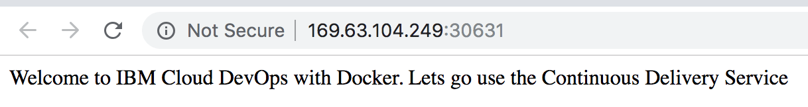

# Continuous Integration | Continuous Delivery - Workshop Lab
Creating a CI/CD Pipeline for deployment to IBM Cloud Kubernetes Cluster using Continuous Delivery Service.

### Overview

In this lab you will be connecting your Git repository having a sample NodeJs application to a Continuous Integration/Continuous Deployment pipeline using Continuous Delivery service that will deploy to a IBM Cloud Kubernetes Service cluster.

### Setup a Continuous Delivery Service

As a prerequisite we require a Continuous Delivery service on IBM Cloud, to create & run the pipeline
Note: Please check and note the region of your Kubernetes cluster, as we need to create a delivery pipeline

1. Lets go to [IBM Cloud Catalog](https://cloud.ibm.com/catalog) and search for ```Continuous Delivery``` OR directly go to [Continuous Delivery Service](https://cloud.ibm.com/catalog/services/continuous-delivery)
2. Select the region and create the service. Optionally, you can add any tag if required.


Note: service creation in the region of your Kubernetes cluster.


### Setup a Container Registry Service

As a prerequisite we require a Continuous Delivery service on IBM Cloud, to create & run the pipeline
Note: Please check and note the region of your Kubernetes cluster, as we need to create.

1.  Lets go to [IBM Cloud Catalog](https://cloud.ibm.com/catalog) and search for ```Container Registry``` OR directly go to [Container Registry Service](https://cloud.ibm.com/kubernetes/catalog/registry)

2. Click on Create.

Note: Please choose the region on top left, same as your Kubernetes cluster.

3. Let us create a `namespace` for our lab today, which will help us to map our git repositories and container images.
Click on `Namespaces` tab and click on it.

 

 On the lower right, we will have to click on `Create namespace`. for example `hellocicd`
 Note: Very unique name required.

 


### Setup our Integration and Delivery Pipeline using IBM Toolchain Service.

We will now setup the Integration & delivery pipeline for our application.

* The pipeline will check for every latest code commit into the repository and compile it.
* Run the unit tests, build the container image.
* Push the image to container registry to keep the updated versions of the code
* Deploy the image to Kubernetes cluster.


1. Go to your [kubernetes cluster](https://cloud.ibm.com/kubernetes/clusters) and select your cluster name. for example: `mycluster` here.
After this click on `DevOps` tab, to setup the pipeline.
 

2. For our lab, we will build & deploy `Develop a Kubernetes App`
 

3. We have to get our delivery pipeline ready. This service will help us to create our code's git repo, Eclipse IDE for code changes also.
 

- Select `Delivery Pipeline`. Create `IBM Cloud API Key` -> `Create` -> `Create`
  This will auto-generate a unique API key.
- Enter the `Container registry namespace` - `hellocicd`, which we created earlier.
- Enter the `cluster namespace` - `hellocicd`. A default namespace will be created, if not provided.
- Click on `Create` to create the toolchain.

4. IBM toolchain creates a github repository, issue tracking, Eclipse Web IDE, and Delivery pipeline

  - Click on Delivery Pipeline to view the stages `BUILD`, `CONTAINERISE`, `DEPLOY`
  - Once all the stages are complete.
  On the **DEPLOY** stage, click **View logs and history**. The DEPLOY stage deploys the app into the Kubernetes cluster. Select the “Deploy to Kubernetes” job, and scroll to the bottom of the log file to find the link to IP:PORT.
  
  

  - Browse to IP:PORT to see the running application
  

Note: We can find all our existing [Toolchains here](https://cloud.ibm.com/devops/toolchains)

### Make changes to our Integration and Delivery Pipeline using IBM Toolchain Service.

Since, we have deployed a containerised code to our Kubernetes cluster. Our **objective** now will be to make changes to it and see and understand
- If its getting re-deployed to the cluster again with a new image version rollout, as soon as there is a new code commit.
- If there is any application downtime on due to the version change, on a container environment.

1. Let us go back to our Toolchain page. If unable to go back then, we can always reach there [Toolchains](https://cloud.ibm.com/devops/toolchains) OR DevOps tab of our Kubernetes cluser (in this case `mycluster`) and find our pipeline project.


2. Click on `Git` to open our repository and make changes to it using the online editor.


3. We can search for a file named `app.js` and click on it.

 


4. and make changes to a UI text, let says change `with Docker` to `with Docker and Kubernetes` and click on commit changes.

 


5. Once code commit is done, we can go back to our delivery pipeline to see that it has kicked off again.


6. When we reach the `DEPLOY` stage, we can see how the new image is being replaced with the older version, without a service disruption, with the kube proxy routing the traffic to the new pods.

 

At this juncture we can test the below command in to see - `pod replacement after new pods are created & up - running.`
We can see it pods being transitioned below...
```console
$ kubectl get pods -n hellocicd
NAME                         READY   STATUS              RESTARTS   AGE
hello-app-5f64b4f899-8zfxd   1/1     Terminating         0          24h
hello-app-5f64b4f899-zqt7n   1/1     Running             0          24h
hello-app-986dcfbc9-bphb2    0/1     ContainerCreating   0          1s
hello-app-986dcfbc9-l2j8w    0/1     ContainerCreating   0          1s
```

```console
$ kubectl get pods -n hellocicd
NAME                         READY   STATUS        RESTARTS   AGE
hello-app-5f64b4f899-8zfxd   1/1     Terminating   0          24h
hello-app-5f64b4f899-zqt7n   1/1     Terminating   0          24h
hello-app-986dcfbc9-bphb2    1/1     Running       0          5s
hello-app-986dcfbc9-l2j8w    1/1     Running       0          5s
```

```console
kubectl get pods -n hellocicd
NAME                        READY   STATUS    RESTARTS   AGE
hello-app-986dcfbc9-bphb2   1/1     Running   0          30m
hello-app-986dcfbc9-l2j8w   1/1     Running   0          30m
```
Note: Kubernetes has created the new pods (i.e 5s)

Alternatively, we can keeping refreshing the UI browser, to suddenly see a `new UI change without any service downtime` of the application.

 
